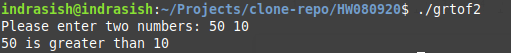

# HW 08/09/20

1. Greatest of two
```
    #include<stdio.h>

    main()
    {
	    int n1, n2;
	    printf("Please enter two numbers: ");
	    scanf("%d%d",&n1,&n2);
	    if( n1 > n2 )
		    printf("%d is greater than %d\n",n1,n2);
	    else
		    printf("%d is greater than %d\n",n2,n1);
    }
```


2. Greatest of three
```
    #include "stdio.h"

    main()
    {
	    int n1,n2,n3,max;
	    printf("Please enter three numbers: ");
	    scanf("%d%d%d",&n1,&n2,&n3);
	    if(n1>n2 && n1>n3)
		    max = n1;
	    else if(n2>n3)
		    max=n2;
	    else
		    max=n3;
	    printf("%d is the greatest of all!\n",max);
    }
```


3. Odd or even
```
    #include "stdio.h"

    main()
    {
	    int n;
	    printf("Please enter a number: ");
	    scanf("%d",&n);
	    if(n%2==0)
		    printf("%d is even\n",n);
	    else
		    printf("%d is odd\n",n);
    }
```


4. Find the largest of two lengths
```
    #include "stdio.h"

    main()
    {
	    float f1,f2,i1,i2;
	    printf("Please enter the first length in Feet and Inch: ");
	    scanf("%f%f",&f1,&i1);
	    printf("Please enter the second length in Feet and Inch: ");
	    scanf("%f%f",&f2,&i2);
	    i1+=f1*12;
	    i2+=f2*12;
	    if(i1>i2)
		    printf("Length #1 is greater\n");
	    else
		    printf("Length #2 is greater\n");
    }
```


5. Check whether a time is AM or PM
```
    #include "stdio.h"

    main()
    {
	    int h;
	    printf("Please enter the time in HH format: ");
	    scanf("%d",&h);
	    h=h%24;
	    if(h>12)
		    printf("PM\n");
	    else
		    printf("AM\n");
    }
```


6. Check whether a year is leap year or not
```
    #include "stdio.h"

    main()
    {
	    int y;
	    printf("Please enter a year: ");
	    scanf("%d",&y);
	    if(y%4==0 && y%100!=0 || y%400==0)
		    printf("%d is a leap year\n",y);
	    else
		    printf("%d is not a leap year\n",y);
    }
```


7. Find the smallest of four numbers
```
    #include "stdio.h"

    main()
    {
	    int n1,n2,n3,n4,min;
	    printf("Please enter four numbers: ");
	    scanf("%d%d%d%d",&n1,&n2,&n3,&n4);
	    if(n1<n2 && n1<n3 && n1<n4)
		    min = n1;
	    else if(n2<n3 && n2<n4)
		    min=n2;
	    else if(n3<n4)
		    min=n3;
	    else
		    min=n4;
	    printf("%d is the smallest\n",min);
    }
```

